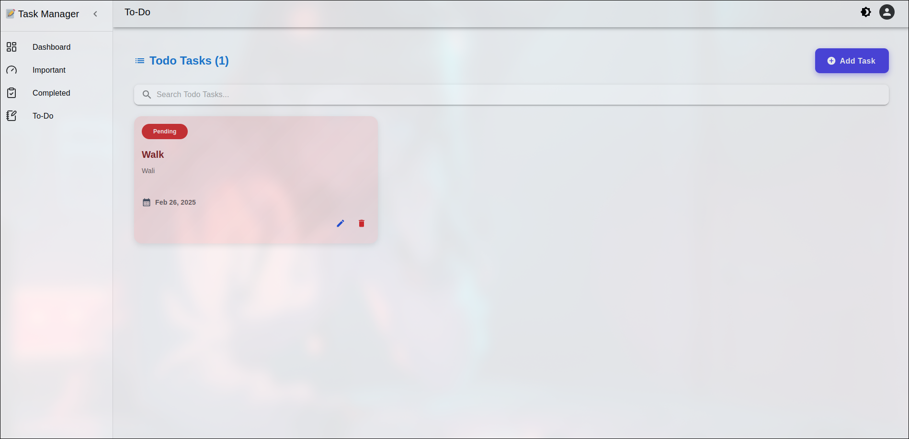

# Advanced React To-Do Application with API Integration

## Objective
This project is dedicated to building a feature-rich **To-Do Application** using ReactJS and Material UI. The application will incorporate **API integration, task prioritization, persistent data storage, and a responsive user interface**, ensuring a seamless and efficient task management experience.

---

## Repository
The source code for this project is hosted on GitHub:  
[GitHub Repository](https://github.com/monikagotnochills/QuadBToDoApp.git)

[Live Link]()

---

## Project Requirements

### 1. **Frontend Development and API Integration**
- **HTML**: Structure the layout of the application.
- **Material UI**: Style the application with Material UI for a modern, responsive design.
- **JavaScript (ES6+)**: Implement application logic.
- **API Integration**: Use a public API (e.g., a weather API) to display relevant data for tasks.
  - Example: If a task is related to outdoor activities, show current weather conditions.
  - Implement error handling for API requests and display errors gracefully in the UI.

---

### 2. **React Components**
- **TaskInput**: Component for adding new tasks.
- **TaskList**: Component for displaying the list of tasks.
- Use **React hooks** (`useState`, `useEffect`) to manage component state effectively.

---

### 3. **Responsive Design**
- Ensure the application is fully responsive for **mobile**, **tablet**, and **desktop** devices.
- Use **CSS Grid** and **Flexbox** features of Tailwind CSS for layout and responsiveness.
- Follow a **mobile-first design approach**.

---

### 4. **Core Functionality**
1. **Add Task**:  
   - Input a task through a text field and add it by pressing a button or hitting Enter.
2. **View Tasks**:  
   - Display all tasks in a list format.
3. **Delete Task**:  
   - Allow users to delete a task with a click of a delete button.
4. **Task Prioritization**:  
   - Enable users to assign priorities (High, Medium, Low) to tasks and display them accordingly.
5. **Persistent Storage**:  
   - Use **local storage** or **session storage** to save tasks, ensuring data persistence across browser sessions.

---

## Installation and Setup
1. Clone the repository:
   ```bash
   git clone https://github.com/monikagotnochills/QuadBToDoApp.git
   ```
2. Navigate to the project directory:
   ```bash
   cd QuadBToDoApp
   ```
3. Install dependencies:
   ```bash
   npm install
   ```
4. Start the development server:
   ```bash
   npm run dev
   ```

---

## Evaluation Criteria
- **Functionality**: Does the application meet the specified requirements?
- **Code Quality**: Is the code well-structured, clean, and maintainable?
- **API Integration**: Is the API integration functional and error-handling implemented effectively?
- **Responsive Design**: Is the application responsive across devices?





